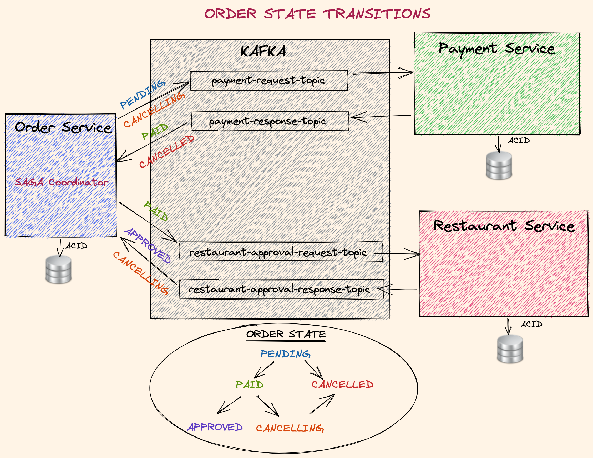
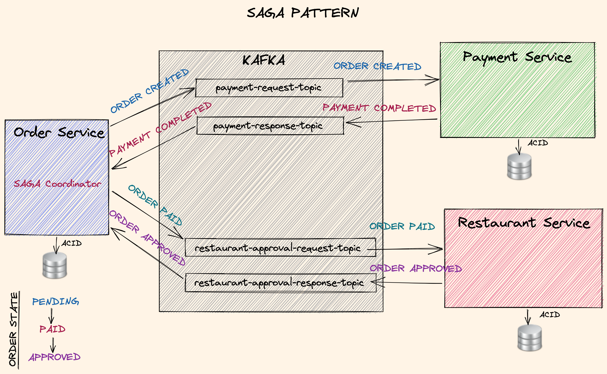

# 食品订购系统 - 文档

## 概述
本项目是一个**分布式食品订购系统**，基于**领域驱动设计（DDD）**、**六边形架构**以及异步消息模式（如 **Kafka**、**SAGA** 和 **Outbox 模式**）构建。这些架构和模式用于处理复杂的工作流、确保容错能力，并在微服务之间维护数据一致性。


---

## 核心架构概念

### 1. 领域驱动设计（DDD）
DDD 是一种软件设计方法，强调领域专家与开发者之间的协作，以创建准确反映业务需求的软件。系统被划分为多个层次：

- **聚合根（Aggregate）**：代表核心领域概念（如 `Order`、`Payment`）。
- **实体（Entity）** 和 **值对象（Value Object）**：封装业务逻辑，确保领域完整性。
- **领域事件（Domain Event）**：捕获系统中的重要变更（如 `OrderCreated`、`PaymentCompleted`）。

本项目中，领域模型体现在 `Order Service` 及其与 `Payment`、`Restaurant` 等服务的交互中。

---

### 2. 六边形架构
又称**端口与适配器架构**，将核心业务逻辑与外部世界分离：

- **主端口（Primary Port）**：接收输入的接口（如 REST API 调用）。
- **次端口（Secondary Port）**：发送输出的接口（如 Kafka 消息通信）。
- **适配器（Adapter）**：处理与外部系统交互的实现（如 Kafka 消息传递、数据库访问）。

本项目中，`payment-request-topic` 和 `restaurant-approval-request-topic` 等 Kafka Topic 作为次级适配器，实现解耦通信。

---

### 3. Kafka
Kafka 作为消息代理，实现微服务间的异步通信。每个服务向特定 Topic 发布和消费事件：

- **Order Service** 发布 `OrderCreated` 等事件，并消费其他服务的响应。
- **Payment Service** 监听 `payment-request-topic`，在 `payment-response-topic` 上响应。
- **Restaurant Service** 监听 `restaurant-approval-request-topic`，在 `restaurant-approval-response-topic` 上响应。

此架构确保了可扩展性和弹性，使各服务能够独立运行。

---

### 4. SAGA 模式
**SAGA 模式**通过协调一系列步骤来管理跨微服务的分布式事务。每个服务执行事务的一部分，并发布事件以指示完成或失败：

- **Order Service** 作为 SAGA 协调器，协调支付处理和餐厅审批等步骤。
- **补偿事务（Compensating Transaction）** 在失败时触发回滚（如支付失败时取消订单）。

详细的订单状态转换图：



---

### 5. Outbox 模式
**Outbox 模式**通过事务性发件箱表确保可靠的事件发布：

- 每个服务将事件作为本地事务的一部分写入其发件箱表。
- 独立进程将这些事件发布到 Kafka，确保**幂等性**和容错能力。

此模式防止消息丢失等问题，保证服务间的最终一致性。

---

## 工作流示例

以下是订单生命周期的步骤：

1. **订单创建**：`Order Service` 创建订单并发布 `OrderCreated` 事件。
2. **支付处理**：`Payment Service` 处理支付并发布 `PaymentCompleted` 事件。
3. **餐厅审批**：`Restaurant Service` 审批订单并发布 `OrderApproved` 事件。
4. **状态转换**：`Order Service` 根据接收到的事件更新订单状态（如 `PENDING -> PAID -> APPROVED`）。

详细的 SAGA 模式消息流图：



---

## 特性

- **弹性微服务**：每个服务通过补偿事务优雅处理故障。
- **可扩展消息传递**：Kafka 实现无缝通信和水平扩展。
- **解耦架构**：六边形架构确保高模块化，便于添加或替换组件。
- **ACID 合规**：每个服务的本地事务确保数据一致性。

---

## 如何运行

1. **部署 Kafka**：启动 Kafka 实例并创建所需 Topic（`payment-request-topic`、`payment-response-topic` 等）。
2. **启动服务**：依次启动 `Order`、`Payment` 和 `Restaurant` 服务。
3. **测试工作流**：使用 Postman 或其他 HTTP 客户端创建订单，通过日志或数据库查询观察状态转换。可在 `/orders` 端点使用以下 JSON 示例：

```json
{
  "customerId": "d215b5f8-0249-4dc5-89a3-51fd148cfb41",
  "restaurantId": "d215b5f8-0249-4dc5-89a3-51fd148cfb45",
  "address": {
    "street": "street_1",
    "postalCode": "1000AB",
    "city": "Amsterdam"
  },
  "price": 200.00,
  "items": [
    {
      "productId": "d215b5f8-0249-4dc5-89a3-51fd148cfb48",
      "quantity": 1,
      "price": 50.00,
      "subTotal": 50.00
    },
    {
      "productId": "d215b5f8-0249-4dc5-89a3-51fd148cfb48",
      "quantity": 3,
      "price": 50.00,
      "subTotal": 150.00
    }
  ]
}
```

---

## 未来增强
- 实现**物化视图**以支持 **CQRS 模式**的快速查询。
- 添加 Kafka 指标和服务健康状况的监控仪表盘。
- 扩展系统以处理消息传递的重试和延迟。

---

本项目展示了结合现代架构模式构建健壮、可扩展分布式系统的能力。
